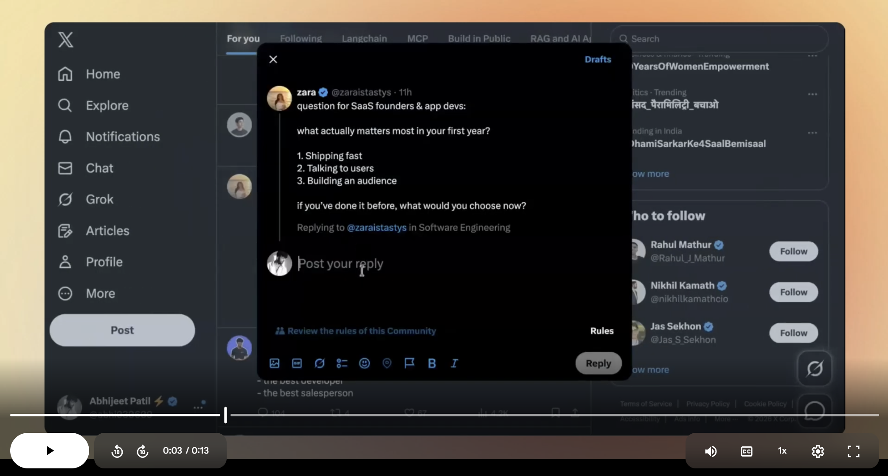
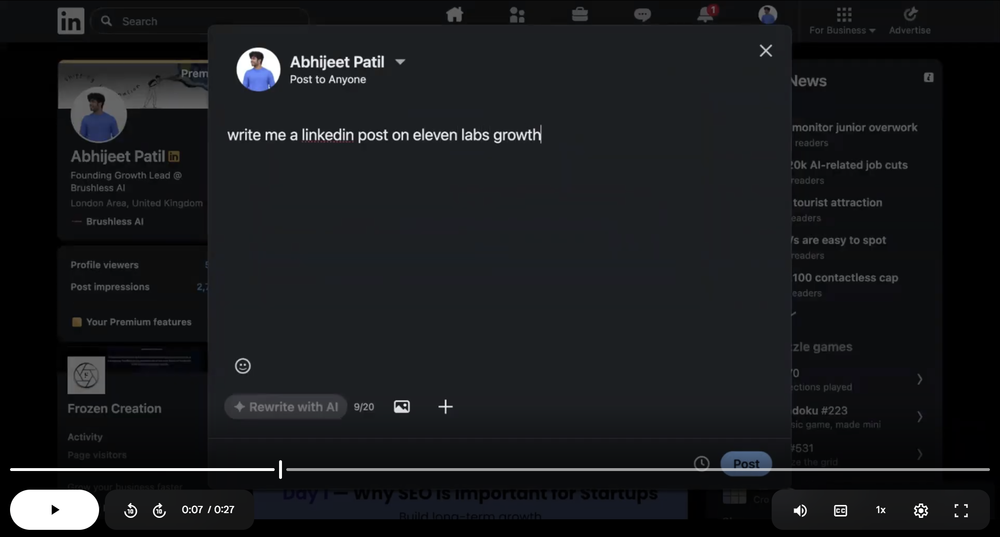

# Function: User Guide

Function is an AI writing assistant that works directly inside the text box you're already using.

## Quick Start 🚀

Best first use: open LinkedIn, X, or Reddit, write 2 to 3 rough lines, then trigger Function, it helps you create better writing directly inside the text box.

## Common Ways to Use Function ✨

### 1. Reply to a post 💬

Open a comment or reply box on LinkedIn or X.
Press your hotkey in the empty box.
Function will generate a reply based on the post.

_Click image to view demo 🎥_

### 2. Write a post ✍️

Open **Start a post** or the post composer.
Press your hotkey in the empty box.
Function will generate a draft close to what you may want to write.

_Click image to view demo 🎥_

### 3. Use voice instructions 🎙️

Hold your hotkey and speak naturally.

Examples:
- "Reply in a funny way."
- "Write a post about this idea in a professional tone."

Use "your hotkey" throughout this guide, since every user may set a different hotkey.

## Best Places to Use Function Right Now 🌍

- Writing a LinkedIn post
- Replying to comments on LinkedIn
- Writing a LinkedIn connection note
- Writing posts on X
- Replying to posts on X
- Replying to emails in Gmail
- Writing fresh emails in Gmail
- Using it in WhatsApp
- Using it in almost any text box where you type

## Quick Troubleshooting 🛠️

- Nothing appeared: Make sure your cursor is inside an active text box before pressing the hotkey.
- The output was close but not perfect: Edit it lightly or try again with a clearer typed or spoken instruction.
- Voice mode did not behave as expected: Speak one clear instruction at a time.

## New Here? 👋

Open any text box, press your hotkey, and Function will help you write directly inside it.

## Join the Community 💬

Join our [Discord community](https://discord.gg/U93SHvWBfk) for discussion, feedback, and product updates.
