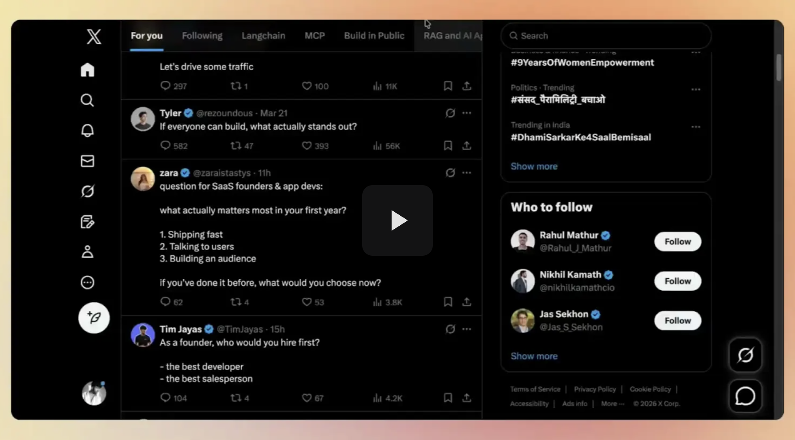
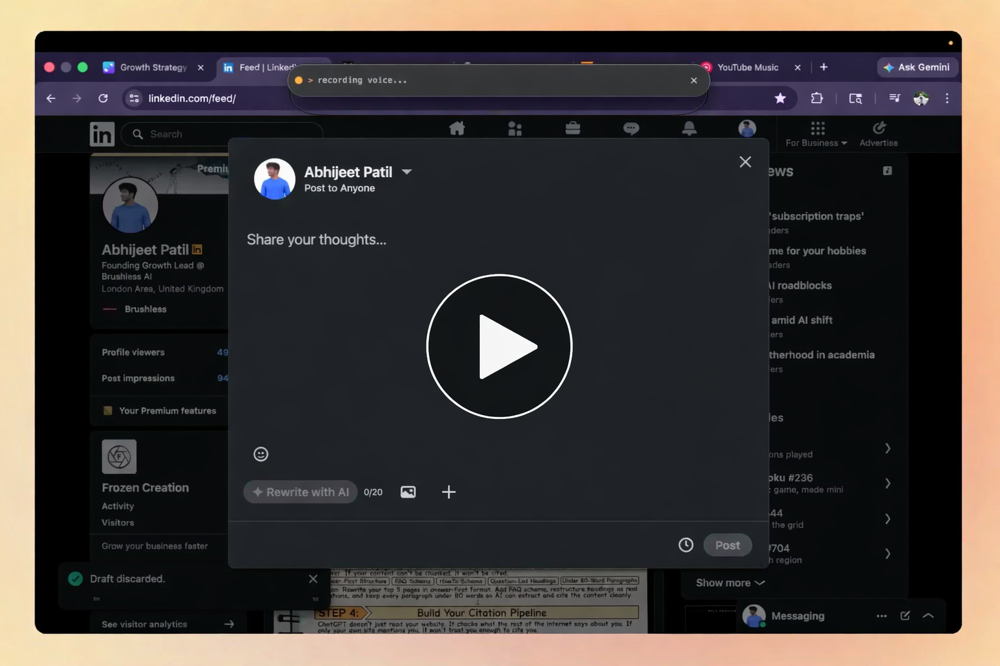

# Function - User Guide

One hotkey, and you're already closer to what you want to say.

## The problem

You know how every time you write a LinkedIn post, email, or reply... you end up opening ChatGPT, pasting your draft, explaining the context, copying the output, pasting it back?

And then doing it all over again for the next one?

Function kills that entire loop.

## How it works

Function is a desktop app that works directly inside the text box you're already typing in.

Function has two modes. Both work right where you're typing.

### 1. Tap the hotkey

You're inside a text box. Maybe you've typed a few rough lines, maybe it's empty.

Tap the hotkey.

Function reads what's on screen... the platform, the context, what you've typed... and generates content right there.

A LinkedIn post, a reply, an email, whatever fits.

### 2. Hold the hotkey + speak

Want more control? Hold the hotkey and speak your instruction out loud.

Just say what you want in plain language:

- "Reply to this in a funny tone"
- "Write a post about why GTM engineering matters"
- "Make this shorter and more professional"

Function listens, processes it, and writes the output directly into the text box.

## Where to use it

Function works in almost any text box on your desktop.

- Writing LinkedIn posts
- Replying to comments on LinkedIn
- Sending LinkedIn connection notes
- Writing posts on X
- Replying to posts on X
- Drafting or replying to emails in Gmail
- Writing messages in WhatsApp
- Messaging in Slack
- Pretty much any text box where you type

## Tips for better results

- Give it something to work with. Even 2 to 3 rough lines help Function understand what you're going for.
- Use voice mode when you want something specific. "Make this punchy" or "write this like a founder"... just say it.
- Start with replies. Open a LinkedIn or X post, click into the reply box, hit the hotkey. Fastest way to see what Function can do.
- Think of it as a strong first draft. A quick edit and you're done. Still way faster than writing from scratch.

## Quick troubleshooting

- Nothing happened when I pressed the hotkey? Make sure your cursor is inside an active text box before pressing.
- Output was close but not quite right? Edit it lightly, or try again with a clearer typed or spoken instruction.
- Voice mode didn't work as expected? Speak one clear instruction at a time. Keep it simple and direct.

## FAQs

### 1. How is this different from ChatGPT?

ChatGPT needs you to open a separate tab, paste your draft, explain the context, copy the output, paste it back. Function skips all of that. It works inside the text box you're already in, knows which platform you're on, and matches your voice automatically.

### 2. Does it work on Mac and Windows?

Yes, both.

### 3. Does the output sound like me?

It gets closer over time. Connect your LinkedIn or X account and Function learns from your past posts. You can also add custom instructions for tone and style.

### 4. Is it free?

Function has a free plan with 30 generations per day. Paid plans are available for heavier usage.

### 5. Can I use it for long-form blogs?

Not right now. Function is built for short-form content... posts, replies, emails, messages.

### 6. I found a bug or have feedback.

Drop it in the feedback on our [Discord community](https://discord.gg/U93SHvWBfk). We are building this with you.

## Links

- 🔗 Download: [github.com/concept1-dev/Function/releases](https://github.com/concept1-dev/Function/releases)
- 💬 Community: [discord.gg/U93SHvWBfk](https://discord.gg/U93SHvWBfk)
